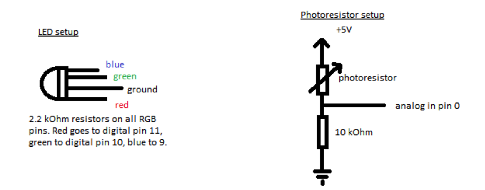

Google CSSI Arduino Workshop
============================
Tutorials and code for the four workshop project options.

Stop Light
-----------
The purpose of this project is to simulate a traffic light by programming times LED lights

1.  Set up your hardware.
2.  We must set our color LED lights to a specific pin in the Arduino.  The red light will be set to pin 10, the blue light (which we will pretend is yellow) is set to pin 11, and so on. We will also set time in between each consecutive light blink.
3.  Next we will set up the main body of our loop, the part of the code which the Arduino will continuously execute.  In our program we have 4 different states:
    * Case #1: Just the yellow pin is on
    * Case #2: Just the green pin is on
    * Case #3: Just the red pin is on
    * Default case: None of the pins are on
4.  The command for turning a light on is: `digitalWrite(yellowPin, HIGH)`,and the command for turning it off is: `digitalWrite(yellowPin, LOW)`. Remember that you will have to turn off each light after it is turned on!
5.  Make the program loop through the 4 cases over and over my using modular (clock) arithmetic.

  
Music
-----
Prerequisite: Stop Light

1. Hook 3.5mm audio cable to breadboard
2. Play music through 8 ohm speakers by touching the wires together.
	* Does polarity matter?
3.  Set this up on the breadboard
4.  Hook a sense line from A0 on the Arduino to the speaker setup.
5. Determine what voltage would make a good limit to turn music on
	* Does this match the ceiling set in the code?

Door Knob Alarm
----------------
The purpose of this project is to build a system that lights up an LED every time a doorknob is touched.

1. Set up your hardware
2. Initialize the pin for the LED (pin #13) to OUTPUT mode
3. Comment out all the code between the `delay(100)` and the two } brackets
4. Compile and run the code
5. Observe and record the number that the computer prints out. This is the sensor's value when the doorknob is at rest (aka not touching anything)
6. Touch the doorknob. Does the computer's output change? Does it get higher or lower? Record this number.
7. Go to the `if(sensorValue > restValue)` statement. If touching the doorknob caused the computer to output a higher number, then set the inequality so that, when the computer outputs a higher value, the code enters the loop. If touching the doorknob caused the computer to output a lower number, then set the inequality so that, when the computer outputs a lower value, the code enters the loop. This may vary per doorknob.
8. Go to `delay( );` and set the delay to 100, indicating 100 microseconds. This is because we want the LED to continue to light up for a brief amount of time
9. Go to `digitalWrite( , );` at the end of the code. This is where you will set the LED pin (located at pin #13) to LOW so that the LED shuts off.

    
Multi-Color Lights
------------------
The purpose of this project is to program a multi-color LED, which changes colors as your hand approaches.

This multi-color light color changes when passing different voltages. Each of the three LEDs share a common cathode (negative) and there are three separate positives. 

1. Set up hardware.
2. Read through the declared variables, and locate digital pins 9, 10 and 11, and analog pin 0 on the Arduino.
3. The `setup()` method will begin the serial communication between the Arduino, and the computer. In the void setup() method,  assign the OUTPUT(s) and INPUT(s) using pinMode, for the red, green, blue and photo-resistor pins.
4. The `loop()` method is the part of the code that will repeat continuously. In the void `loop()` method, set the time delay in milliseconds. NOTICE that the timing always operates in milliseconds, and not seconds. 
5. Now we will set the colors of the multi-color LED. The colors change based on the reduction in voltage. As the digital number representing the measured voltage changes, the colors change from red, to yellow, to green, to turquoise, to blue, and to purple. 
6.  Lastly, the `analogWrite()` function writes the color values to the LED. Insert the inputs for the blue color. 

